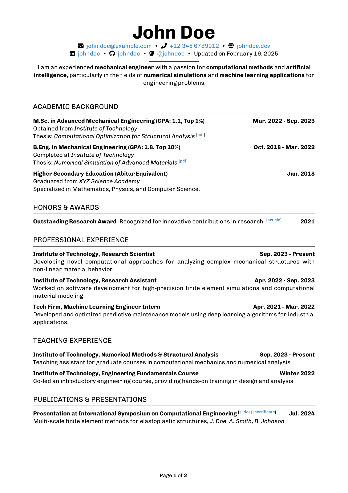

# L<sup>A</sup>T<sub>E</sub>X CV Template

This is a customizable LaTeX template for creating a professional, single/multipage CV or résumé. This template emphasizes clarity, organization, and easy customization, and is ideal for academic, technical, or industry positions. It provides the curriculumvitae document class, which offers several commands for structured, visually appealing CV formatting.

<p align = "center">
     
</p>


## Features

- Clean, minimalist design optimized for readability
- Section headers with icons for easy navigation and a polished look
- Automatic formatting of contact information, including name, location, email, phone, website and GitHub
- Pre-defined section commands for common CV elements: education, experience, skills, projects, etc.


## Prerequisites

Ensure you have a LaTeX distribution installed, such as  or , and that your editor supports compiling with additional LaTeX packages. This template uses:

- `geometry`
- `paratype`
- `CharisSIL`
- `stix`
- `fontenc`
- `xcolor`
- `fancyhdr`
- `setspace`
- `microtype`
- `parskip`
- `enumerate`
- `graphicx`
- `tikz`
- `hyperref`
- `lastpage`
- `fontawesome5`


## Quick Start

1. Clone the repository:
```sh
git clone https://github.com/schmaeke/latex-cv-template.git
cd latex-cv-template
```
You can use `example.tex` file as a basis for your CV.

2. Edit your personal information in the main .tex file
```latex
\name{John}
\surname{Smith}
\residence{Berlin}
\nationality{German}
\mail{contact@johnsmith.tld}
\phone{+49.171.5556789}
\web{johnsmith.tld}
\github{johnsmith}
```

3. Customize sections by adding entries in education, experience, skills, projects, and hobbies, using provided commands:
```latex
\cvsection{\faGraduationCap}{Education}
\cvdatedentry{Berlin University}{Mar. 2021 - Sep. 2022}{%
    M.Sc. in Mechanical Engineering (Grade: 1.2) \\
    Thesis: \textit{Advanced Methods for Plasticity Analysis}
}
```
Individual entries will be connected with each other, if there is no blank line between them.

4. Compile the `.tex` file using a LaTeX editor or command line:
```sh
pdflatex your_cv_file.tex
```

5.	View the PDF to check your output!


## Template Commands

Basic Structure

- `\cvhead`: Generates the CV header with name, contact info, and profile summary.
- `\cvsection{Icon}{Section Title}`: Creates a section title with an icon from Font Awesome.
- `\cvdatedentry{Institution}{Date Range}{Details}`: Adds an entry with a title, date, and description.
- `\cventry{Title}{Details}`: Creates a basic entry without a date.


### Icons

This template uses  icons for a modern look. Some examples include:

- `\faGraduationCap` for Education
- `\faStore*` for Professional Experience
- `\faTools` for Skills


### Colors and Formatting

The template uses four different colors for fore- and background. If you don't like the default ones overwrite
- `background` default is `RGB(255, 255, 255)`
- `highlightedBackground` default is `RGB(220, 230, 235)`
- `foreground` default is `RGB(0, 0, 0)`
- `highlightedBackground` default is `RGB(50, 105, 175)`


## License

This template is distributed under the MIT License. See LICENSE for more details.


## Contributing

Contributions, issues, and feature requests are welcome! Feel free to fork and submit pull requests to improve this template.
