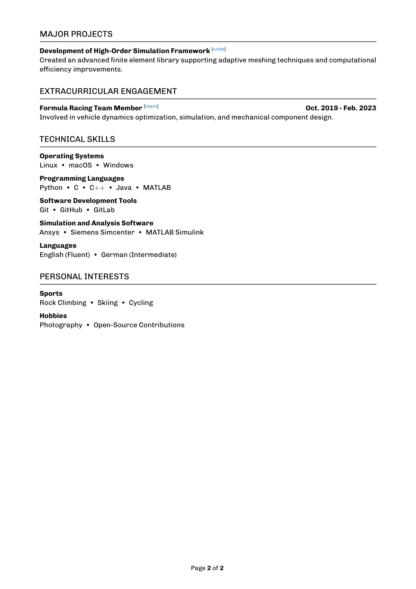

# LATEX CV Template

This is a customizable LaTeX template for creating a professional, single/multipage CV or résumé. This template emphasizes clarity, organization, and easy customization, and is ideal for academic, technical, or industry positions. It provides the `curriculum-vitae` document class, which offers several commands for structured, visually appealing CV formatting.

     

